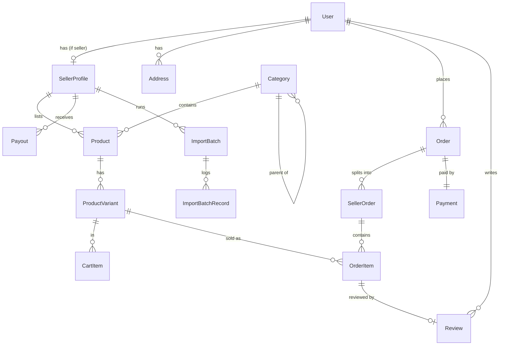

# Data Model

## Master Data vs. Transactional Data

A useful split for most business apps:

- **Master data** — relatively stable reference/core entities that other things point to.
  Changes rarely, usually via an admin flow. Examples: users, products, categories, accounts,
  price lists, org units.
- **Transactional data** — records of things that happened, usually time-stamped and
  append-heavy, referencing master data by ID. Examples: orders, payments, bookings, audit logs,
  sessions.

Why it matters for AI-assisted builds: master data usually needs full CRUD + validation +
admin UI; transactional data usually needs create + read + (rarely) reversal/correction, but
almost never update-in-place or delete — get this distinction into the spec and Claude won't
generate an "edit order" screen you didn't want, or skip audit trails on data that needed one.

## Entities

Timestamp convention: every timestamp is stored in UTC regardless of where the user is. Display
formatting and time-zone conversion are `ui-guidelines.md`'s problem (v1 displays everything in
Europe/Bucharest — see that file).

### User — Master

- **Purpose:** Base account for every human actor (buyer, seller, admin all share this table;
  seller-specific fields live on `SellerProfile`).
- **Key fields:** id, email (unique), passwordHash, name, phone, role (buyer / seller / admin),
  emailVerifiedAt, status (active / suspended), sessionVersion (int, default 0 — **[UPDATED]**
  bumped to force-invalidate every outstanding session/JWT for this user; see
  security.md > Authentication), createdAt, updatedAt
- **Natural/external key:** email (unique, used for login and as the natural key for support
  lookups). No external system identifier — this app owns identity.
- **Relationships:** has one `SellerProfile` (if role = seller), has many `Address`, has many
  `Order` (as buyer), has many `Review`, has many `Notification`
- **Lifecycle:** created via self-registration (email/password + verification). Editable by the
  owning user (profile fields) and by Admin (status, role). Never hard-deleted — on a deletion
  request (GDPR), PII fields are anonymized in place (`name`, `email`, `phone` overwritten) while
  the row and its id are retained so historical `Order`/`Review` foreign keys stay valid.
- **Status change timestamps:** `suspendedAt` in addition to `status`, so "since when was this
  account suspended" is answerable without an audit-log join.
- **Bulk operations:** none — users are never bulk-imported.
- **Delete/cascade semantics:** soft-delete/anonymize only (see Lifecycle above); `Order`,
  `Review`, and `AuditLog` rows referencing a deleted user's id are never removed.
- **Constraints / invariants:** email unique across the whole table (one account per email
  regardless of role).

---

### SellerProfile — Master

- **Purpose:** Seller-specific business data and marketplace status, one-to-one with a `User`
  whose role is `seller`.
- **Key fields:** id, userId (FK, unique), storeName, storeSlug (unique), description, logoUrl,
  businessRegistrationNumber, stripeConnectAccountId, commissionRateOverride (nullable),
  status (pending / approved / suspended / rejected), appliedAt, approvedAt, suspendedAt
- **Natural/external key:** `businessRegistrationNumber` (e.g. Romanian CUI) — the seller's legal
  business identifier, needed for KYC/payout compliance and to detect a business re-applying
  under a new account.
- **Relationships:** belongs to one `User` (one-to-one); has many `Product`; has many `Payout`
- **Lifecycle:** created when a user submits a seller application (case 4 in functional.md); moves
  pending → approved/rejected by Admin; can be suspended later by Admin. Never deleted — a
  suspended seller's products are deactivated, not removed, so past orders remain intact.
- **Status change timestamps:** `appliedAt`, `approvedAt`, `suspendedAt` — each transition gets
  its own timestamp so "since when has this seller been suspended" is a direct field read.
- **Bulk operations:** not itself bulk-imported; its `Product` children are (see below).
- **Delete/cascade semantics:** suspending a `SellerProfile` cascades to deactivating all of that
  seller's active `Product` rows (status → inactive); it does not touch existing `Order`/
  `SellerOrder` history.
- **Constraints / invariants:** `storeSlug` unique (used in storefront URLs); a `User` can have at
  most one `SellerProfile`.

---

### Category — Master

- **Purpose:** Hierarchical product categorization (tree), drives storefront navigation.
- **Key fields:** id, name, slug (unique), parentId (nullable, self-referencing), imageUrl,
  isActive, defaultCommissionRate
- **Natural/external key:** none — internal taxonomy the platform owns.
- **Relationships:** self-referencing tree (parentId → Category); has many `Product`
- **Lifecycle:** created/edited only by Admin. Can be deactivated (`isActive = false`) but not
  hard-deleted while any `Product` still references it.
- **Status change timestamps:** not needed — category activation is infrequent and not
  audit-critical beyond the standard `AuditLog`.
- **Bulk operations:** none in v1 (category tree is managed manually by Admin).
- **Delete/cascade semantics:** delete is blocked if any `Product` references the category;
  Admin must reassign or deactivate products first.
- **Constraints / invariants:** `slug` unique; `parentId` must not create a cycle.

---

### Product — Master

- **Purpose:** A sellable item owned by exactly one seller.
- **Key fields:** id, sellerId (FK), categoryId (FK), sku (unique per seller), name, slug,
  description, brand, images (array of URLs), status (draft / pending_review / active / inactive /
  rejected), createdAt, updatedAt, activatedAt, deactivatedAt, lastImportBatchId (nullable)
- **Natural/external key:** `sku`, unique per seller (not globally — two sellers may reuse the
  same SKU string for their own products). This is the matching key for bulk import.
- **Relationships:** belongs to one `SellerProfile`; belongs to one `Category`; has many
  `ProductVariant`; has many `Review`
- **Lifecycle:** created by the seller (draft), submitted for review, Admin approves (active) or
  rejects; seller can deactivate/reactivate an approved product. Never hard-deleted — referenced
  by past `OrderItem` rows, so deletion is always a soft status change.
- **Status change timestamps:** `activatedAt`, `deactivatedAt` in addition to `status`.
- **Bulk operations:** yes, via CSV import in three modes (add-only / full-replace / attribute-
  update) — see functional.md > Use Case 5 for exact mode semantics, and `ImportBatch` /
  `ImportBatchRecord` below for how each run is tracked.
- **Delete/cascade semantics:** deactivation only (status → inactive); `OrderItem` rows keep a
  denormalized snapshot of name/price at time of purchase so they remain meaningful even after
  the product is later deactivated or its price changes.
- **Constraints / invariants:** `(sellerId, sku)` unique; must belong to an `isActive` category to
  go live.

### ProductVariant — Master

- **Purpose:** A purchasable variant of a product (e.g. size/color), each with its own price and
  stock. A product with no real variants still gets exactly one default variant.
- **Key fields:** id, productId (FK), sku, attributes (JSON, e.g. `{"size":"M","color":"red"}`),
  price, compareAtPrice (nullable, for showing a discount), stockQty
- **Natural/external key:** `sku`, unique per seller (same scheme as `Product.sku`).
- **Relationships:** belongs to one `Product`; referenced by `OrderItem`, `CartItem`
- **Lifecycle:** created/edited by the owning seller. Never deleted while any `OrderItem`
  references it — deactivate via the parent `Product`'s status instead.
- **Status change timestamps:** inherits the parent `Product`'s status timestamps; no separate
  status field of its own.
- **Bulk operations:** included in the same CSV import as `Product` (a row maps to one variant).
- **Delete/cascade semantics:** blocked from hard delete if referenced by any `OrderItem`.
- **Constraints / invariants:** `stockQty >= 0`; stock decrement on checkout must be atomic (see
  operations.md > Concurrency & Write Correctness) to prevent overselling.

---

### Address — Master

- **Purpose:** A buyer's saved shipping/billing address.
- **Key fields:** id, userId (FK), label, recipientName, line1, line2, city, county, postalCode,
  country, phone, isDefault
- **Natural/external key:** none.
- **Relationships:** belongs to one `User`; referenced by `Order.shippingAddressId`
- **Lifecycle:** created/edited/deleted freely by the owning buyer. `Order` stores a denormalized
  snapshot of the address at time of purchase (not a live FK-only reference), so editing or
  deleting an `Address` later never changes a past order's shipping record.
- **Status change timestamps:** not applicable.
- **Bulk operations:** none.
- **Delete/cascade semantics:** deletable freely — see denormalized snapshot note above.
- **Constraints / invariants:** exactly one address per user may have `isDefault = true`.

---

### Review — Master

- **Purpose:** A buyer's rating/review of a specific purchased product.
- **Key fields:** id, productId (FK), buyerId (FK), orderItemId (FK — proves a verified purchase),
  rating (1-5), title, body, status (pending / approved / rejected), createdAt
- **Natural/external key:** none.
- **Relationships:** belongs to one `Product`, one `User` (buyer), one `OrderItem`
- **Lifecycle:** created by the buyer only after the related `OrderItem`'s sub-order is
  `delivered`; goes through a `pending → approved/rejected` moderation step by Admin before it's
  publicly visible. Buyer can edit/delete their own review within a short window (e.g. 30 days).
- **Status change timestamps:** not needed beyond `createdAt`/`updatedAt` — moderation is
  infrequent enough that `AuditLog` covers the "who rejected this and when" question.
- **Bulk operations:** none.
- **Delete/cascade semantics:** deleting a `Product` (i.e. deactivating it) leaves existing
  reviews in place, shown on the now-inactive listing.
- **Constraints / invariants:** one review per `orderItemId` (can't review the same purchased
  line twice).

---

### Cart / CartItem — Transactional

- **Purpose:** In-progress, pre-purchase selection. Guests get a session-bound cart; it merges
  into the buyer's persistent cart on login.
- **Key fields:** Cart — id, userId (nullable for guest), sessionId (nullable for logged-in),
  updatedAt. CartItem — id, cartId (FK), productVariantId (FK), quantity
- **Natural/external key:** none.
- **Relationships:** Cart has many CartItem; CartItem references one ProductVariant
- **Lifecycle:** created implicitly on first "add to cart"; items freely added/removed/updated in
  place (this is the one case in the data model where update-in-place on a "transactional-ish"
  table is correct — a cart isn't a record of something that happened yet). Cleared on successful
  checkout (converted into an `Order`).
- **Bulk operations:** none.
- **Delete/cascade semantics:** abandoned guest carts are periodically purged (e.g. after 30 days
  of inactivity) by a background job.
- **Constraints / invariants:** `quantity >= 1`; quantity is re-validated against live stock at
  checkout time, not trusted from the cart.

### Order — Transactional

- **Purpose:** A buyer's single checkout event; the umbrella that groups one or more
  seller-specific `SellerOrder`s sharing one payment.
- **Key fields:** id, orderNumber (unique, user-facing), buyerId (FK), status (aggregate, derived
  from its SellerOrders), totalAmount, currency, shippingAddressSnapshot (JSON, denormalized
  copy — see Address above), createdAt
- **Natural/external key:** `orderNumber` — the identifier shown to the buyer and used for
  support lookups.
- **Relationships:** belongs to one `User` (buyer); has many `SellerOrder`; has one `Payment`
- **Lifecycle:** created at checkout start, finalized on payment success. Never edited after
  creation except for its derived `status`; never deleted.
- **Bulk operations:** none — orders are never bulk-created/imported.
- **Delete/cascade semantics:** immutable/permanent; no cascade delete path exists.
- **Constraints / invariants:** `totalAmount` must equal the sum of its `SellerOrder.subtotal`
  values plus shipping/fees.

### SellerOrder — Transactional

- **Purpose:** The per-seller sub-order split out of an `Order`, since each seller fulfills and
  gets paid independently.
- **Key fields:** id, orderId (FK), sellerId (FK), status (pending / confirmed / shipped /
  delivered / cancelled / returned), subtotal, commissionAmount, payoutAmount, trackingNumber,
  shippedAt, deliveredAt, cancelledAt
- **Natural/external key:** none beyond the parent `Order.orderNumber`.
- **Relationships:** belongs to one `Order`; belongs to one `SellerProfile`; has many `OrderItem`
- **Lifecycle:** created alongside its parent `Order`. Status is advanced only by the owning
  seller (confirm/ship) or Admin (cancel/refund on dispute) — a buyer can request cancellation
  but not set status directly.
- **Status change timestamps:** `shippedAt`, `deliveredAt`, `cancelledAt` — each transition
  timestamped individually, not just the current `status`.
- **Bulk operations:** none.
- **Delete/cascade semantics:** immutable/permanent, same as `Order`.
- **Constraints / invariants:** `commissionAmount` is computed at creation time from the
  commission rate in effect then (seller override → category default → platform default) and
  frozen — a later rate change never retroactively changes past orders.

### OrderItem — Transactional

- **Purpose:** One line item within a `SellerOrder`, with a frozen snapshot of what was actually
  bought.
- **Key fields:** id, sellerOrderId (FK), productVariantId (FK), productNameSnapshot,
  unitPriceSnapshot, quantity, lineTotal
- **Natural/external key:** none.
- **Relationships:** belongs to one `SellerOrder`; references one `ProductVariant`; referenced by
  at most one `Review`
- **Lifecycle:** created once at checkout, never edited or deleted.
- **Bulk operations:** none.
- **Delete/cascade semantics:** immutable/permanent.
- **Constraints / invariants:** `lineTotal = unitPriceSnapshot * quantity`.

### Payment — Transactional

- **Purpose:** Record of the Stripe payment backing an `Order`.
- **Key fields:** id, orderId (FK), stripePaymentIntentId, amount, currency, status (pending /
  succeeded / failed / refunded), paidAt
- **Natural/external key:** `stripePaymentIntentId` — used to de-duplicate Stripe webhook
  deliveries (see operations.md > Concurrency).
- **Relationships:** belongs to one `Order`
- **Lifecycle:** created when checkout starts a Stripe Payment Intent; status updated only by
  Stripe webhook events, never by client-trusted input.
- **Bulk operations:** none.
- **Delete/cascade semantics:** immutable/permanent.
- **Constraints / invariants:** exactly one `Payment` per `Order` in v1 (no split/partial
  payments).

### Payout — Transactional

- **Purpose:** Record of a Stripe Connect transfer of a seller's net earnings out of the platform
  account.
- **Key fields:** id, sellerId (FK), periodStart, periodEnd, amount, stripeTransferId, status
  (pending / paid / failed), paidAt
- **Natural/external key:** `stripeTransferId`.
- **Relationships:** belongs to one `SellerProfile`; conceptually aggregates many `SellerOrder`
  rows within its period (no direct FK — derived by date range + seller at generation time)
- **Lifecycle:** created by a scheduled background job (see operations.md > Background Jobs).
  Never edited by a user directly.
- **Bulk operations:** generated in batch by the payout job, not user-initiated bulk import.
- **Delete/cascade semantics:** immutable/permanent.
- **Constraints / invariants:** a given `SellerOrder`'s commission/payout amount must be included
  in exactly one `Payout`.

### ImportBatch — Transactional

- **Purpose:** A trackable run record for a seller's bulk product CSV import, separate from the
  per-row change log below. Powers import history and debugging a failed run.
- **Key fields:** id, sellerId (FK), mode (add_only / full_replace / attribute_update), status
  (pending / processing / completed / failed), totalRows, succeededRows, failedRows, startedAt,
  completedAt
- **Natural/external key:** none.
- **Relationships:** belongs to one `SellerProfile`; has many `ImportBatchRecord`
- **Lifecycle:** created when a seller uploads a file, processed asynchronously (see
  performance.md > Bulk/File Operation Performance), status finalized on completion.
- **Bulk operations:** this entity *is* the bulk-operation run record.
- **Delete/cascade semantics:** immutable/permanent (kept as import history).
- **Constraints / invariants:** only one `ImportBatch` with status `pending`/`processing` may
  exist per seller at a time (enforced at the data-access layer) — prevents two concurrent
  imports for the same seller from racing on the same products.

### ImportBatchRecord — Transactional

- **Purpose:** Per-row detail of what a bulk import did to one SKU — the thing a batch-level
  summary count can't answer ("what changed on record X").
- **Key fields:** id, importBatchId (FK), sku, action (created / updated / skipped / failed /
  deactivated), errorMessage (nullable), beforeValue (JSON, nullable), afterValue (JSON)
- **Natural/external key:** none (references the target product by `sku` string, since the
  product may not have existed before this row ran).
- **Relationships:** belongs to one `ImportBatch`
- **Lifecycle:** written once per row during processing; never edited afterward.
- **Bulk operations:** written by the `ImportBatch` process itself.
- **Delete/cascade semantics:** immutable/permanent.
- **Constraints / invariants:** see "Change Auditing" section below for duplicate-key and
  partial-failure rules that this table encodes.

### AuditLog — Transactional

- **Purpose:** Compliance-sensitive change history, independent of the record it describes —
  who changed what, old value → new value, when. Covers everything in the "Change Auditing"
  section below plus all Admin actions.
- **Key fields:** id, actorUserId (FK, nullable for system/job actors), action, entityType,
  entityId, beforeValue (JSON, nullable), afterValue (JSON), createdAt
- **Natural/external key:** none.
- **Relationships:** references a `User` (actor) and, loosely by `entityType`/`entityId`, any
  other entity — not a hard FK, so the log survives even if the referenced row's lifecycle
  changes.
- **Lifecycle:** append-only, written by the service layer whenever an audited action occurs.
- **Bulk operations:** not itself bulk-edited; it *records* bulk operations at per-record
  granularity via one row per changed field/record (in addition to `ImportBatchRecord`, which is
  import-specific; `AuditLog` also covers manual admin/seller edits outside of import).
- **Delete/cascade semantics:** immutable/permanent; retention governed by security.md > Audit /
  Logging.
- **Constraints / invariants:** never updated or deleted once written.

### Notification — Transactional

- **Purpose:** In-app notification-center entry mirroring an email sent to a user (see
  functional.md > Notifications).
- **Key fields:** id, userId (FK), type, payload (JSON), readAt (nullable), createdAt
- **Natural/external key:** none.
- **Relationships:** belongs to one `User`
- **Lifecycle:** created alongside the corresponding email send; marked read when the user views
  it.
- **Bulk operations:** none directly (though a single bulk import completion generates one
  notification, not one per row).
- **Delete/cascade semantics:** old read notifications may be purged after a retention window
  (e.g. 90 days) by a background job; not compliance-sensitive.
- **Constraints / invariants:** none beyond belonging to exactly one user.

---

## Change Auditing

- Entities needing full change history (old value → new value, who, when), not just a current
  status field: `Product` (price/stock/status edits), `SellerProfile` (approval/suspension/
  commission-rate changes), `SellerOrder` (status transitions), `Payment` (status transitions),
  and any Admin action on another user's data.
- Mechanism: a dedicated `AuditLog` entity (recommended here since several of the above are
  compliance-sensitive — financial amounts and seller approval/suspension — and need to be
  queryable independent of the record they describe, e.g. "show me every commission-rate change
  this quarter" across all sellers at once).
- Bulk operations: each individual record change gets its own audit entry — `ImportBatchRecord`
  (one row per SKU processed) rather than just the `ImportBatch` summary counts. A batch-level
  summary alone can't answer "what happened to SKU X."
- Full-sync detection mechanism (for the `full_replace` import mode): no persistent
  pending/confirmed column is needed on `Product`. During processing, the import job builds an
  in-memory (or job-scoped temp table) set of SKUs seen in the file; once the file is fully
  processed, any of that seller's currently-active `Product` rows whose SKU is *not* in the seen
  set are deactivated in one pass. This avoids a two-phase pending/confirmed flag on the
  `Product` table itself, since the whole operation already runs as one background job.
- Bulk-operation run record: yes — `ImportBatch` (status + total/succeeded/failed counts),
  separate from the per-record `ImportBatchRecord` log, as defined above.
- Duplicate natural keys within a single batch: the **last occurrence wins**; the earlier
  occurrence(s) for the same SKU within that file still get an `ImportBatchRecord` entry (action
  = `skipped`, with a note that it was superseded later in the same batch), so the overwrite is
  visible rather than silent.
- Partial-failure policy: **valid rows are applied, invalid rows are skipped and reported** —
  each row's outcome is independent. The batch's overall `status` is `completed` if at least one
  row succeeded, and `failed` only if every row failed or the file itself couldn't be parsed at
  all. The seller sees a per-row error list, not just a pass/fail for the whole file.

## Relationships Overview

## Data Retention / Archival

- Buyer PII: anonymizable on request per GDPR (see `User` > Lifecycle) — this app is EU/Romania-
  facing.
- Financial records (`Order`, `SellerOrder`, `Payment`, `Payout`): retained long-term for tax/
  accounting purposes. Romanian fiscal law commonly requires ~10 years for financial records —
  *treat this as a placeholder, not legal advice; confirm the exact figure with an accountant/
  legal advisor before launch.*
- `AuditLog`: retained at least as long as the entities it covers remain relevant to a dispute —
  see security.md > Audit / Logging for the specific retention window.
- Abandoned guest `Cart` rows: purged after 30 days of inactivity (not compliance-driven, just
  housekeeping).
